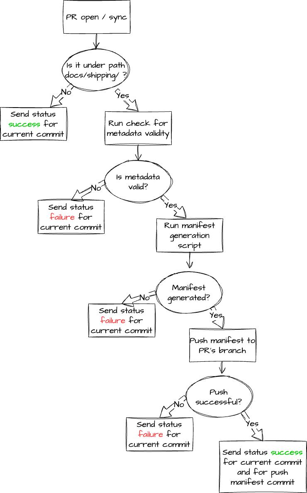

# Files validation script

The script is responsible on validating a shipping doc file, based on pre-defined conventions.

## Sample

Currently, a valid format for a file should look like this:

```markdown
---
id: sample
title: Sample Document
overview: this is the description of a test
product: ['logs', 'metrics']
os: ['windows', 'linux']
filters: ['aws', 'cloud']
logo: https://docs.logz.io/images/logo/logz-symbol.svg
logs_dashboards: ['dfsdfgsdgfds', 'sdfgsdfg', 'hrtgwgs']
logs_alerts: ['sdfgs', 'xcvdb']
logs2metrics: ['ersefg']
metrics_dashboards: ['sdfgfsdg', 'sdfgsdyuiuyifg']
metrics_alerts: ['azxsvb']
drop_filter: ['jslijwe']
---

test


#### Sample

text

##### Sample

text
```

## Requirements

Any file under path `docs/shipping` that is a **markdown** (`.md`) file, should meet the following requirements:
- Metadata section should be at the beginning of the file.
- Metadata section should be opened and closed with a line containing `---`.
- The metadata fields mentioned in the sample above are **REQUIRED**.
- If a field containing an array doesn't have relevant values, it still needs to appear as part of the metadata, but it should contain an empty array (`[]`)

## Workflow 



## Changelog:

- **0.0.3**:
  - Bug fix - validate only markdown files.
- **0.0.2**:
  - More details error logs.
  - Match validation to new sub-folder structure.
- **0.0.1**: Initial release.